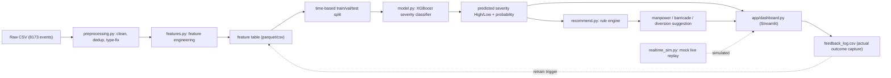

# Implementation Plan — Event-Driven Traffic Congestion Forecasting System

> Self-contained spec. A new engineer/LLM with only this file and the CSV can build the system end-to-end. Every decision and its reasoning lives here.

---

## 1. Problem Summary

Bengaluru traffic control-room operators currently deploy manpower, barricades, and diversions by experience. This system forecasts the **impact severity of a traffic event/incident at report time** and converts that forecast into concrete, transparent resource recommendations, so high-impact events are pre-positioned for instead of reacted to.

---

## 2. Scope Decision

Source dataset: `Astram event data_anonymized - Astram event data_anonymizedb40ac87.csv` — 8,173 rows × 46 columns, Bengaluru, 2023-11-09 → 2024-04-08. It is an **incident-report log**, not a planned-event-impact dataset (94% unplanned, mostly vehicle breakdowns). There is **no congestion/delay/vehicle-count/manpower/barricade column.**

Confirmed decisions (from stakeholder):
- **Primary target:** `priority` ∈ {High, Low} — severity classification (clean, 0% missing, 5030/3141 ≈ 62/38 balance).
- **Scope of "event":** ALL 8,173 records treated as disruptions (maximizes data, more robust model).
- **Stack:** Python + scikit-learn/XGBoost, modular components, Streamlit dashboard, **CSV-only** (no external enrichment).

| Sub-problem | Status | Why |
|---|---|---|
| **Forecasting** | IN SCOPE (full) | `priority` target + clean features (type, cause, geo, time) exist. |
| **Recommendation** | IN SCOPE (rule-based ONLY) | No deployment-outcome ground truth (`assigned_to_police_id` 98.4% empty, no barricade/manpower counts). Cannot be learned — must be transparent heuristic. |
| **Real-time adjustment** | OUT (SIMULATED for demo) | Static snapshot; no live traffic/speed/volume feed. Build a mock signal replayer, not a real ingestor. |
| **Post-event learning** | IN SCOPE (schema + logging only) | Outcomes logged (`status`, `closed_datetime`) but no predicted-vs-actual pairing recorded. Ship the feedback schema + capture mechanism, not a trained online loop. |

**Honest framing for judges:** one strong, well-validated forecast model + a transparent rule-engine + a simulated real-time view + a designed feedback loop. We do not claim a learned recommender or live ingestion the data cannot support.

---

## 3. System Architecture



Data flow: raw CSV → preprocessing → feature engineering → feature store → time-based split → severity model → recommendation rule-engine → dashboard output → feedback log → (re-feeds feature store on retrain).

---

## 4. Data Pipeline Spec

### 4.1 Cleaning (column-by-column)
- **Drop (100% / near-empty, no signal):** `map_file`, `comment`, `meta_data` (100% empty); `cargo_material`, `reason_breakdown`, `age_of_truck` (96.6% empty); `route_path` (98.3%), `direction` (99.5%), `assigned_to_police_id` (98.4%), `citizen_accident_id` (98.4%), `resolved_at_address/latitude/longitude` (99.1%), `resolved_by_id` (99.1%), `kgid`, `created_by_id`, `last_modified_by_id`, `closed_by_id`, `resolved_by_id`, `client_id` (audit/identifier — leakage risk).
- **`id`:** keep as row key only; never a feature.
- **`event_type`:** map to {planned, unplanned}. Keep.
- **`event_cause`:** lowercase + strip; merge `Debris`/`debris`, normalize `Fog / Low Visibility`. Keep.
- **`requires_road_closure`:** cast TRUE/FALSE → bool. Keep as feature (NOT target — but watch leakage; see 4.3).
- **`status`:** {closed, active, resolved}. Used for feedback/duration derivation, NOT a forecast feature (only known after the fact).
- **`priority`:** TARGET. Map High→1, Low→0. Drop any rows with null priority (0% here, so none).
- **`latitude`/`longitude`:** to float; drop rows with (0,0) or out-of-Bengaluru-bbox (lat∉[12.7,13.25] or lon∉[77.3,77.9]) as geo-invalid; flag count in report.
- **`corridor`:** strip; fill 0.2% missing with `"unknown"`. Keep (22 cats).
- **`zone`, `gba_identifier`:** 57.9% missing → fill `"unknown"`; keep as categorical (spatial macro features).
- **`police_station`:** 0% missing, 54 cats — keep (high-cardinality categorical).
- **`junction`:** 69.3% missing → keep as `has_junction` boolean + top-N one-hot for frequent junctions; rest `"other"`.
- **`veh_type`:** 40.2% missing → fill `"none"` (absence is meaningful: non-vehicle events). Keep.
- **`start_datetime`:** parse (UTC, strip `+00`/microseconds). Source of all time features. **Convert to IST (UTC+5:30)** before extracting hour/day — operational decisions are local-time.
- **`end_datetime`, `closed_datetime`, `resolved_datetime`, `created_date`, `modified_datetime`:** used only to derive outcome/duration for the feedback module and EDA — **never forecast features** (post-event leakage).
- **Deduplication:** flag exact duplicate (lat, lon, start_datetime, event_cause) clusters; keep but add `dup_cluster_size` feature (repeated reports at same junction are a real congestion signal — e.g. MekhriCircle×64).

### 4.2 Feature engineering (forecast-time-safe features only)
Only features knowable at the moment an event is reported:
- **Event:** `event_type` (1-hot), `event_cause` (1-hot, 17→ collapse rare <20 into `other`), `requires_road_closure` (bool — known at report), `veh_type` (1-hot).
- **Spatial:** `corridor`, `zone`, `gba_identifier`, `police_station` — target/frequency encoding (high cardinality) OR one-hot for low-card; `is_corridor` (corridor != "Non-corridor"); `lat`, `lon` (raw + optional KMeans cluster id, k≈15, as a "hotspot zone").
- **Temporal (IST):** `hour`, `hour_bucket` {night 0-5, morning 6-10, midday 11-15, evening 16-20, late 21-23}, `day_of_week`, `is_weekend`, `month`, `is_peak_hour` (∈{5,6,19,20,21,22} per observed peaks).
- **Historical lookup (no leakage — use only PRIOR events):** for each event's (police_station or corridor), rolling count of events in the trailing 7/30 days *strictly before* its timestamp; `station_hist_high_rate` = historical High-priority share at that station computed on train only and applied forward.
- `dup_cluster_size` (see 4.1).

Encoders (target/frequency) MUST be fit on train split only, then applied to val/test (prevent leakage).

### 4.3 Leakage guardrails
- Exclude all `*_datetime` outcome columns, `status`, and resolution-duration from forecast features.
- `requires_road_closure`: keep, but document that it is an operator input known at report time (planned closures), not an outcome. If judges challenge, provide an ablation run without it.
- Target/historical encoders fit on train only.

### 4.4 Split strategy — TIME-BASED (mandatory)
Event data is temporal; random split leaks future into past. Sort by `start_datetime`:
- **Train:** 2023-11-09 → 2024-02-15 (~first 70%).
- **Val:** 2024-02-16 → 2024-03-10 (~15%).
- **Test:** 2024-03-11 → 2024-04-08 (~15%).
Tune `hour`/encoder thresholds on val; report final metrics on the untouched test window only. Provide exact row counts after splitting in the run log.

---

## 5. Modeling Plan

### 5.1 Models (start simple → escalate only if justified)
1. **Baseline:** `DummyClassifier(strategy="most_frequent")` + Logistic Regression on one-hot features. Establishes floor.
2. **Primary:** **XGBoost / `GradientBoostingClassifier`** (tabular, mixed categorical/numeric, handles non-linearities and interactions; industry default for this data shape). `scale_pos_weight` or `class_weight` to handle 62/38 imbalance.
3. Optional: `RandomForest` as a sanity cross-check.

### 5.2 Evaluation metrics (target = priority High vs Low)
- Primary: **F1 (High class)** and **PR-AUC** (mild imbalance → PR-AUC more honest than ROC-AUC).
- Secondary: precision/recall per class, confusion matrix, accuracy.
- **Operational metric:** recall on High (missing a High event = under-deployment = the costly error). Tune decision threshold on val to hit a target High-recall (e.g. ≥0.80) and report the precision trade-off.
- Report feature importances (gain) + a SHAP summary (optional) for explainability to judges.

### 5.3 ⚠️ Compute Requirement Flag (mandatory)
**All modeling here is CPU-only on a normal laptop.** Dataset is 8,173 rows × ~30–60 features. XGBoost/GBM/LogReg train in **seconds to <1 minute** on CPU. RAM < 1 GB. **No GPU. No Colab/Kaggle required for the planned build.**

The only paths that would become heavy — and are therefore **explicitly OUT of scope** unless requested:
> ### ⚠️ Heavy Compute — Recommend Colab/Kaggle (only if these optional paths are pursued)
> - **Deep learning (tabular transformer / TabNet / NN embeddings for geo+text):** marginal gain on 8k rows, needs GPU, 10–60 min/run. **Not justified** at this data size — do NOT build locally; if explored, run on Google Colab/Kaggle GPU.
> - **Large hyperparameter sweep (>500 trials Optuna / nested CV grid):** can take 30+ min and pin all CPU cores. If desired, run on Kaggle. For the planned build use a **small RandomizedSearchCV (≤50 iters)** instead — trivial on laptop.
>
> These are flagged now so they are never hit by surprise mid-build.

---

## 6. Recommendation Engine Spec (rule-based)

No deployment-outcome ground truth exists → transparent, auditable rule engine (NOT a model). Lives in `src/recommend.py`.

**Inputs:** predicted `severity` (High/Low) + `probability`, `event_cause`, `requires_road_closure`, `corridor`/`is_corridor`, `event_type`, `hour_bucket`, `dup_cluster_size`.

**Outputs (dict):** `manpower_count` (int), `barricade_count` (int), `barricade_placement` (str), `diversion_suggested` (bool), `diversion_note` (str), `rationale` (list of fired rules).

**Rule logic (initial, documented & tunable):**
- Base manpower by severity: High → 4, Low → 1.
- Multipliers/additions:
  - `+2` if `requires_road_closure` is TRUE.
  - `+2` if `event_cause` ∈ {procession, protest, vip_movement, public_event} (crowd events).
  - `+1` if `is_corridor` (major artery).
  - `+1` if `hour_bucket` ∈ {morning, evening} (peak) AND severity High.
  - `+min(dup_cluster_size//2, 3)` (repeated hotspot reports).
- Barricades: `barricade_count = 0` if not closure and Low; `= 2` if closure FALSE & High; `= 4 + crowd_bonus` if `requires_road_closure`. Placement string keyed off corridor/junction.
- `diversion_suggested = requires_road_closure OR (severity High AND is_corridor)`; `diversion_note` references corridor name.
- **Fallback (model unavailable / prob in dead-band 0.4–0.6):** fall back to a pure `event_cause × requires_road_closure` lookup table (computed from historical High-rate per cause) so the engine never hard-fails.

All thresholds centralized in a `RULES` config dict at top of file for easy judge-facing tuning. Recommendation has NO ground truth → validate by **face-validity / domain sanity table**, not accuracy metrics; state this openly.

---

## 7. Post-Event Feedback Loop Spec (schema + capture)

No predicted-vs-actual pairing in source data → ship the mechanism, not a trained online loop.

**`feedback_log.csv` schema:**
`event_id, timestamp, event_cause, predicted_severity, predicted_prob, recommended_manpower, recommended_barricades, diversion_suggested, actual_severity, actual_resolution_mins, actual_manpower_used, operator_override, notes, logged_at`

- On each dashboard prediction, append the prediction row (actual_* blank).
- Operator fills `actual_*` post-event (or it's auto-filled from a re-exported CSV via `status`/`closed_datetime` → `actual_resolution_minutes`, capped/winsorized at 99th pct to kill the bulk-close artifacts noted in EDA: mean 7,800 min / max ~2M min are administrative, not real).
- **Retrain trigger (documented, semi-manual):** when feedback_log has ≥N new labeled rows, append to training data and re-run `model.py`; track metric drift in a `model_registry.csv`.

This demonstrates the closed loop to judges even though only the schema/capture runs in the demo.

---

## 8. File / Folder Structure

```
round 2/
├── data/
│   ├── raw/                  # original CSV (symlink/copy)
│   └── processed/            # cleaned + feature tables (parquet/csv)
├── notebooks/
│   └── 01_eda.ipynb          # exploratory analysis (mirrors Phase B)
├── src/
│   ├── config.py             # paths, column lists, bbox, RULES dict
│   ├── preprocessing.py      # load + clean (Section 4.1)
│   ├── features.py           # feature engineering + leakage-safe encoders (4.2)
│   ├── split.py              # time-based split (4.4)
│   ├── model.py              # train/eval/save XGBoost (Section 5)
│   ├── recommend.py          # rule engine (Section 6)
│   └── realtime_sim.py       # mock live replay (simulated real-time)
├── app/
│   └── dashboard.py          # Streamlit demo (Section 10)
├── models/
│   └── severity_xgb.pkl      # trained artifact
├── feedback_log.csv          # Section 7
├── tests/
│   ├── test_preprocessing.py
│   ├── test_features.py      # leakage / encoder-fit-on-train assertions
│   └── test_recommend.py     # rule face-validity assertions
├── requirements.txt
├── implementation.md         # this file (living doc)
└── README.md
```

Per project convention (tests-first): each `src/` module gets its test written before the implementation; iterate until green.

---

## 9. Step-by-Step Build Order

Each step = one session, with a "done when" criterion. Tests written before code per repo rule.

1. **Repo + deps.** Create folders, `requirements.txt` (pandas, numpy, scikit-learn, xgboost, streamlit, pytest, matplotlib), `config.py`. *Done when:* `pip install -r requirements.txt` succeeds in a venv and `pytest` runs (0 tests).
2. **EDA notebook.** Reproduce Phase B numbers in `01_eda.ipynb` (counts, missingness, distributions, duration artifact, time peaks). *Done when:* notebook runs top-to-bottom and confirms row/col counts (8173×46) and target balance.
3. **Preprocessing.** `test_preprocessing.py` first (drops empty cols, geo-bbox filter, priority→{0,1}, no nulls in target). Then `preprocessing.py`. *Done when:* tests pass and a clean DataFrame with documented row count is saved to `data/processed/clean.parquet`.
4. **Features.** `test_features.py` first (encoders fit on train only, no `*_datetime`/`status` in feature matrix, IST conversion correct). Then `features.py`. *Done when:* feature matrix produced, leakage tests green.
5. **Split.** `split.py` time-based; assert train.max_date < val.min_date < test.min_date. *Done when:* three non-overlapping time windows with logged row counts.
6. **Model.** Baseline (Dummy + LogReg) → XGBoost. `test` asserts model beats baseline F1 on val. Tune threshold for High-recall on val. *Done when:* test-window F1/PR-AUC + confusion matrix reported, artifact saved to `models/`.
7. **Recommendation engine.** `test_recommend.py` first (e.g. High+closure+procession ⇒ manpower ≥ documented floor; fallback fires when model missing). Then `recommend.py`. *Done when:* face-validity table green.
8. **Real-time simulator.** `realtime_sim.py` replays test-window rows in timestamp order, emits predictions live (sleep/step). *Done when:* CLI replay prints rolling predictions.
9. **Dashboard.** `app/dashboard.py` Streamlit: input form (event attributes) → severity + probability → recommendation card → map of historical hotspots + simulated live feed tab. *Done when:* `streamlit run app/dashboard.py` shows a working demo end-to-end.
10. **Feedback wiring + README.** Append predictions to `feedback_log.csv`; write README with run instructions + screenshots. *Done when:* a prediction creates a log row and README reproduces the demo.

---

## 10. Demo / Output Plan

Hackathon deliverable = **Streamlit dashboard** with:
- **Forecast tab:** operator enters event type/cause/location/time → live severity prediction (High/Low + confidence gauge).
- **Recommendation card:** manpower count, barricade count/placement, diversion suggestion, with the **rationale (fired rules)** shown for trust.
- **Map view:** historical hotspot clusters (MekhriCircle, SilkBoard, etc.) + corridor overlay.
- **Simulated real-time tab:** replay of the test window showing predictions streaming in (labeled clearly as simulated).
- **Model report tab:** confusion matrix, F1/PR-AUC, feature importances — defends model quality to judges.
Backup artifact: the EDA notebook + a one-slide architecture diagram (Section 3 Mermaid).

---

## 11. Open Questions / Assumptions Log (living — append, don't rewrite)

**Resolved (stakeholder, 2026-06-21):**
- R1. Target = `priority` (High/Low classification). 
- R2. Scope = ALL 8,173 records as disruptions (not planned-only).
- R3. Stack = Python + sklearn/XGBoost, modular + Streamlit, CSV-only (no external enrichment).

**Assumptions made (proceeding unless corrected):**
- A1. Timestamps are UTC (`+00` suffix) → converted to IST for operational time features.
- A2. `requires_road_closure` is an operator input known at report time, usable as a feature (ablation provided if challenged).
- A3. Resolution-duration is too noisy (bulk-close artifacts) to be a primary target; used only winsorized in feedback module.
- A4. Bengaluru bbox lat[12.7,13.25]/lon[77.3,77.9] for geo-validity filtering; (0,0) rows treated as missing geo.
- A5. Rule-engine numeric thresholds (manpower bases/bonuses in Section 6) are initial best-guess, domain-tunable — no ground truth to fit them.
- A6. Demo runs entirely on CPU/laptop; no Colab needed.

**Open questions (non-blocking, default assumption in parentheses):**
- Q1. Are the rule-engine resource numbers acceptable as-is, or is there a domain SME table to calibrate against? (default: use Section 6 values.)
- Q2. Should rare crowd-event causes (protest=15, vip_movement=20) get a dedicated boosted model, or is the single model + rule bonus enough? (default: single model + rule bonus.)
- Q3. Is map visualization expected (needs lat/long plotting lib like pydeck), or are tables sufficient? (default: include map via st.map/pydeck.)
